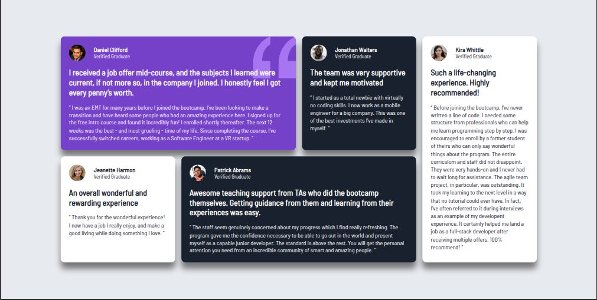

# Frontend Mentor - Testimonials grid section solution

This is a solution to the [Testimonials grid section challenge on Frontend Mentor](https://www.frontendmentor.io/challenges/testimonials-grid-section-Nnw6J7Un7). Frontend Mentor challenges help you improve your coding skills by building realistic projects.

## Table of contents

- [The challenge](#the-challenge)
- [Screenshot](#screenshot)
- [My process](#my-process)
- [Built with](#built-with)
- [What I learned](#what-i-learned)
- [Continued development](#continued-development)
- [Author](#author)
- [Acknowledgments](#acknowledgments)

### The challenge

Users should be able to:

- View the optimal layout for the site depending on their device's screen size

### Screenshot



## My process

- To be honest, I don't even know how I manage to do this...

### Built with

- Semantic HTML5 markup
- CSS custom properties
- Flexbox
- CSS Grid
- Desktop-first workflow
- CSS Variables

### What I learned

- I leaned how to use `Grid-template-area` and `Grid-area`

```css
.grid {
  display: grid;
  max-width: 80%;
  grid-auto-columns: 1fr;
  grid-template-areas:
    "un un deux cinq"
    "trois quatre quatre cinq";
  gap: 1.5rem;
```

- Background-image :

```css
.un {
  background-image: url(images/bg-pattern-quotation.svg);
  background-repeat: no-repeat;
  background-position: top right;
}
```

### Continued development

- Properly center a grid
- Media queries
- Mobile-first Workflow
- CSS variables
- background images

## Author

- Frontend Mentor - [@Jeanclaude09-dev](https://www.frontendmentor.io/profile/Jeanclaude09-dev)
- Github - [@jeanclaude09-dev](https://github.com/Jeanclaude09-dev)

## Acknowledgments

- I want to thank "Sana Khan" - [@Sana-zen](https://www.frontendmentor.io/profile/Sana-zen) I learned the correct tag to use for a testimonial with her solution
